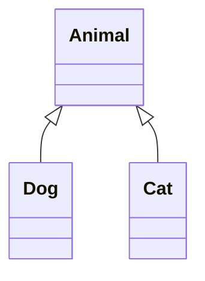
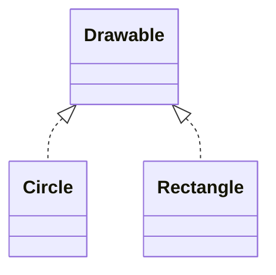
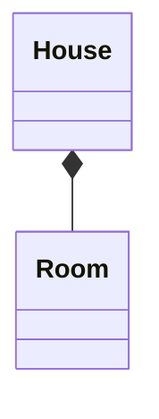
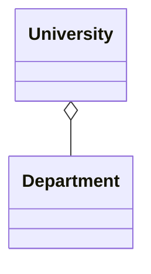
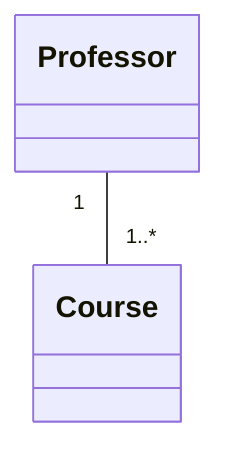
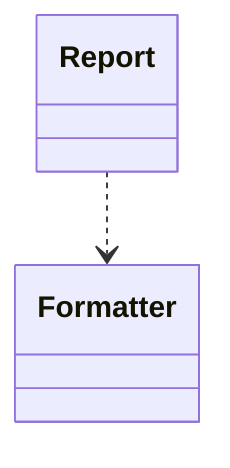
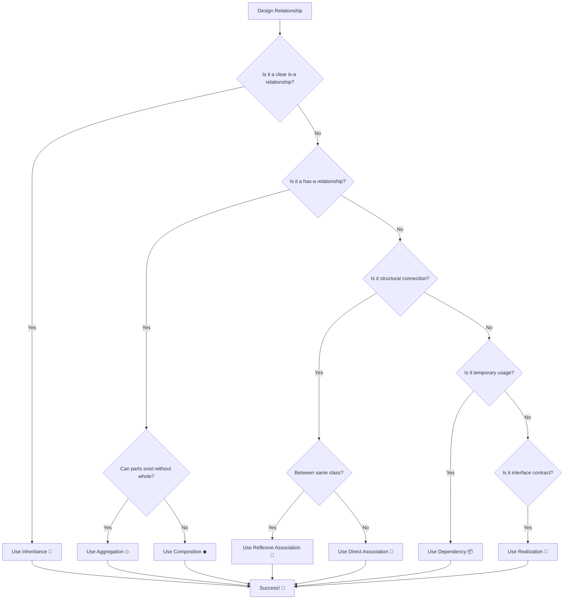
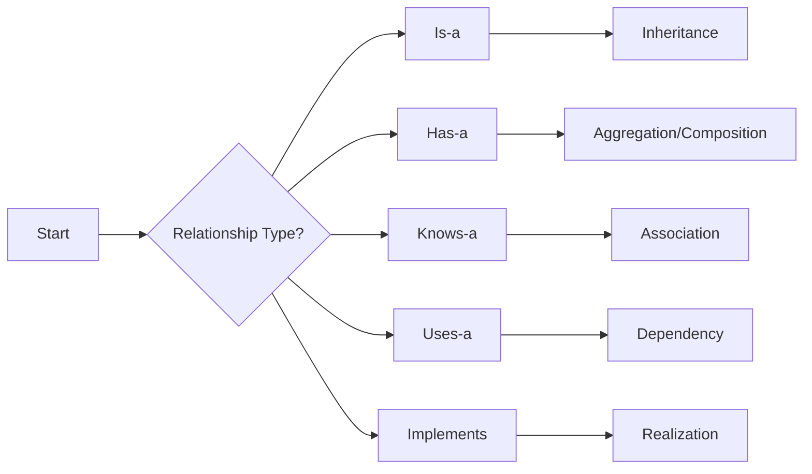
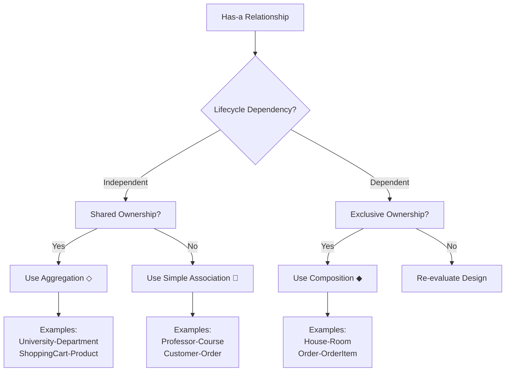

# 🏗️ UML Relationships Guide


**A comprehensive guide to UML class relationships with PHP examples and interactive diagrams**


## 📖 Overview

This repository provides a complete reference guide to **UML Class Diagram Relationships** with practical PHP examples and interactive Mermaid diagrams. Whether you're learning UML, designing software architecture, or preparing for technical interviews, this guide has you covered!

### 🎓 What You'll Learn

- ✅ All 6 fundamental UML class relationships
- ✅ Practical PHP implementation examples
- ✅ Mermaid diagram syntax for visualization
- ✅ When to use each relationship type
- ✅ Decision guides for choosing the right relationship

## 🎯 Quick Reference Tables

### 1. Main UML Relationships

| Relationship Type | Symbol | Lifecycle | Example |
|------------------|---------|-----------|---------|
| **Inheritance** 🎯 | `─────▷` | N/A | `Car → Vehicle` |
| **Realization** 📜 | `- - - ▷` | N/A | `Circle → Drawable` |
| **Composition** ◆ | `◆────` | Dependent | `House → Room` |
| **Aggregation** ◇ | `◇────` | Independent | `University → Department` |
| **Dependency** 📦 | `- - ->` | None | `Report → Formatter` |

### 2. Association Variants

| Association Type | Symbol | Lifecycle | Example |
|-----------------|---------|-----------|---------|
| **Uni-directional** | `─────→` | Independent | `Order → Customer` |
| **Bi-directional** | `──────` | Independent | `Professor ↔ Course` |
| **Reflexive** | `──────` | Independent | `Employee → Employee` |

## 🔗 Relationship Types

### 1. 🎯 Inheritance (Generalization)
**"Is-a" relationship**


### 2. 📜 Realization (Implementation)  
**"Implements" relationship**


### 3. ◆ Composition
**Strong "has-a" relationship**


### 4. ◇ Aggregation
**Weak "has-a" relationship**


### 5. 🤝 Association
**"Knows-a" relationship**


### 6. 📦 Dependency
**Temporary "uses-a" relationship**


## 📊 Mermaid Diagrams

This repository uses **Mermaid.js** for all UML diagrams, making them:
- 🎨 Easy to create and modify
- 📱 Responsive and interactive
- 🔄 Version control friendly
- 🌐 Renders on GitHub natively

# 🗺️ UML Relationship Decision Guide



## 🔍 Detailed Decision Process

### Step 1: Identify Relationship Type


### Step 2: Has-a Relationship Detailed Flow


## ✨ Complete Relationship Matrix

| Relationship | When to Use | Lifecycle | Strength | Example |
|-------------|-------------|-----------|----------|---------|
| **Inheritance** 🎯 | "Is-a" relationship | N/A | Strong | `Car` **is-a** `Vehicle` |
| **Aggregation** ◇ | "Has-a" + independent parts | Independent | Medium | `University` **has** `Departments` |
| **Composition** ◆ | "Has-a" + dependent parts | Dependent | Strong | `House` **has** `Rooms` |
| **Association** 🤝 | "Knows-a" relationship | Independent | Medium | `Professor` **knows** `Courses` |
| **Dependency** 📦 | Temporary "uses-a" | None | Weak | `Report` **uses** `Formatter` |
| **Realization** 📜 | "Implements" contract | N/A | Medium | `Circle` **implements** `Drawable` |

## 🐘 PHP Examples for Each Decision

### 1. **Inheritance** (Is-a)
```php
class Vehicle {}
class Car extends Vehicle {} // Car IS-A Vehicle
```

### 2. **Aggregation** (Has-a + Independent)
```php
class University {
    private array $departments = [];
    public function addDepartment(Department $dept) {
        $this->departments[] = $dept; // Department exists independently
    }
}
```

### 3. **Composition** (Has-a + Dependent)
```php
class House {
    private array $rooms = [];
    public function __construct() {
        $this->rooms[] = new Room(); // Room created with House
    }
}
```

### 4. **Association** (Knows-a)
```php
class Professor {
    private array $courses = [];
    public function teach(Course $course) {
        $this->courses[] = $course; // Knows about Course
    }
}
```

### 5. **Dependency** (Uses-a)
```php
class Report {
    public function generate() {
        $formatter = new Formatter(); // Temporary usage
        return $formatter->format($this->data);
    }
}
```

### 6. **Realization** (Implements)
```php
interface Drawable {
    public function draw();
}
class Circle implements Drawable {
    public function draw() { /* implementation */ }
}
```

## 🚀 Practical Decision Checklist

### Ask These Questions:

1. **"Is [Child] a type of [Parent]?"** → **Inheritance**
2. **"Does [Whole] have [Part] that can exist separately?"** → **Aggregation**
3. **"Does [Whole] have [Part] that cannot exist separately?"** → **Composition**
4. **"Does [ClassA] know about [ClassB] structurally?"** → **Association**
5. **"Does [ClassA] temporarily use [ClassB]?"** → **Dependency**
6. **"Does [Class] fulfill [Interface] contract?"** → **Realization**

## 📋 Quick Reference Card

| If you need... | Choose... |
|----------------|-----------|
| **Code reuse + hierarchy** | Inheritance |
| **Collections of independent objects** | Aggregation |
| **Strong ownership with shared lifecycle** | Composition |
| **Structural connections between peers** | Association |
| **Temporary method-level usage** | Dependency |
| **Multiple behaviors/contracts** | Realization |

## ⚠️ Common Pitfalls & Solutions

| Pitfall | Wrong Choice | Right Choice |
|---------|-------------|--------------|
| "Car has Engine" | Inheritance ❌ | Composition ✅ |
| "University has Professors" | Composition ❌ | Aggregation ✅ |
| "Button implements Clickable" | Inheritance ❌ | Realization ✅ |
| "Order uses Calculator" | Association ❌ | Dependency ✅ |

---

<div align="center">

## ⚖️ **Ultimate Relationship Rule**

**"Choose the WEAKEST relationship that meets your needs"**

*Weak relationships = More flexible, maintainable code*

**Strength Order:**  
Dependency 📦 < Association 🤝 < Realization 📜 < Aggregation ◇ < Composition ◆ < Inheritance 🎯

</div>
