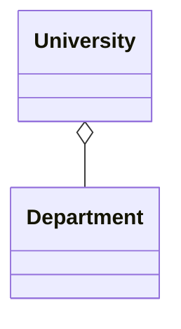
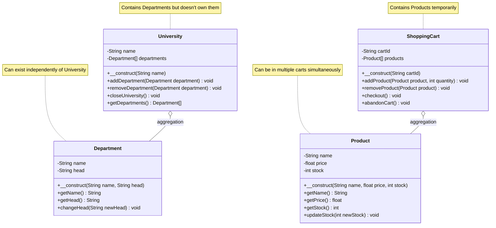
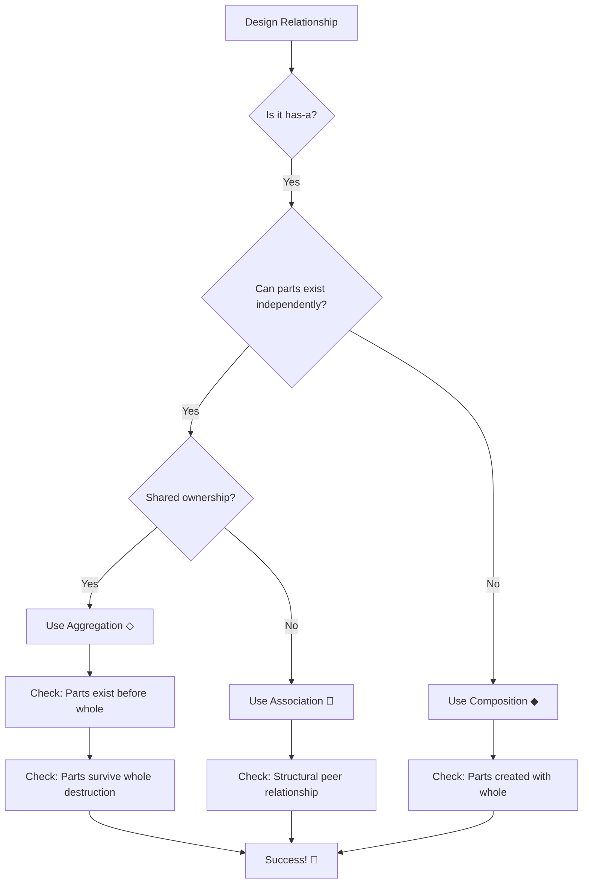

# 🔗 UML Aggregation Relationship

## 📐 1. Symbol
**UML Notation:** `◇────`

**Visual Representation:**
```
[Whole] ◇──── [Part]
```

## 🔄 2. Mermaid Symbol
**Mermaid Code:** `Whole o-- Part`

**Example:**


## 📖 3. Definition
> 🎯 **Aggregation** is a weak **"has-a"** relationship where the part can exist independently of the whole. The whole contains parts but doesn't control their lifecycle.

## 📝 4. Brief Description
🏛️ Aggregation represents a collection or group relationship:

- ✅ **Weak "has-a"** relationship
- ✅ **Shared ownership** - parts can belong to multiple wholes
- ✅ **Independent lifecycle** - parts exist before/after the whole
- ✅ **Optional membership** - parts can be added/removed freely

## ⭐ 5. Characteristics

| Feature | Description | Emoji |
|---------|-------------|--------|
| **Relationship Type** | Weak "has-a" | 🏛️ |
| **Strength** | Medium coupling | 🎯 |
| **Lifecycle** | Independent | 🔄 |
| **Ownership** | Shared | 🤝 |
| **Multiplicity** | Usually many-to-many | 🔢 |
| **Persistence** | Stored references | ✅ |
| **PHP Implementation** | Method parameters/setters | 🐘 |

**🎯 Key Points:**
- ✅ Parts exist before the whole is created
- ✅ Parts continue to exist after the whole is destroyed
- ✅ Parts can be shared between multiple wholes
- ✅ Flexible membership
- ⚠️ Weaker coupling than composition


## 📊 6. Mermaid Diagram



## 🚀 7. Use Cases

- ### 🎯 When to Use Aggregation

| Use Case | Example | Reason |
|----------|---------|--------|
| **Collections** | `University` → `Department` | Departments can exist independently |
| **Group Membership** | `Team` → `Employee` | Employees can be in multiple teams |
| **Temporary Containers** | `ShoppingCart` → `Product` | Products exist outside carts |
| **Shared Resources** | `Playlist` → `Song` | Songs can be in multiple playlists |

- ### ⚠️ When to Avoid Aggregation

| Scenario | Better Approach | Reason |
|----------|----------------|--------|
| **Dependent parts** | **Composition** | Parts cannot exist without whole |
| **Exclusive ownership** | **Composition** | Parts belong to only one whole |
| **Structural connection** | **Association** | Peer relationship, not containment |

## 🆚 8. Aggregation vs Composition

| Aspect | Aggregation ◇ | Composition ◆ |
|--------|---------------|---------------|
| **Relationship** | "Belongs-to" | "Parts-of" |
| **Lifecycle** | Independent | Dependent |
| **Ownership** | Shared | Exclusive |
| **Strength** | Weak | Strong |
| **Example** | `University` → `Department` | `House` → `Room` |

## 🎯 9. Quick Decision Guide



---

<div align="center">

## 🎯 **Aggregation Rule of Thumb**

**"Use aggregation when you can honestly say:  
'The parts can exist and have meaning without the whole'"**

*Example: "Departments can exist even if the University closes" ✅  
Counter-example: "Rooms cannot exist if the House is demolished" ❌*

**Aggregation represents FLEXIBLE COLLECTIONS of independent objects**

</div>