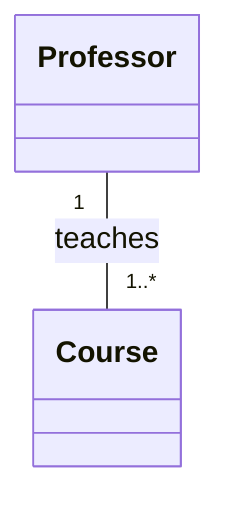
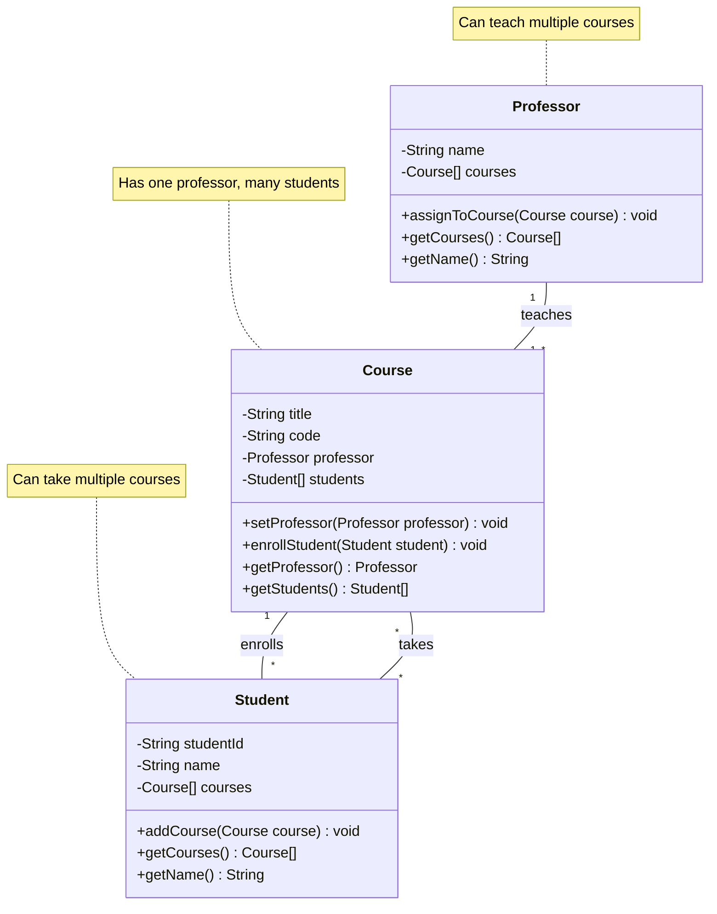
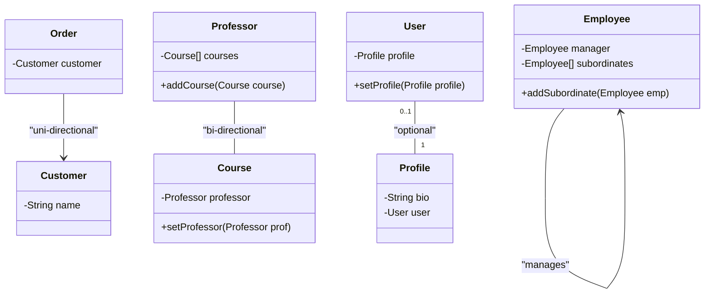
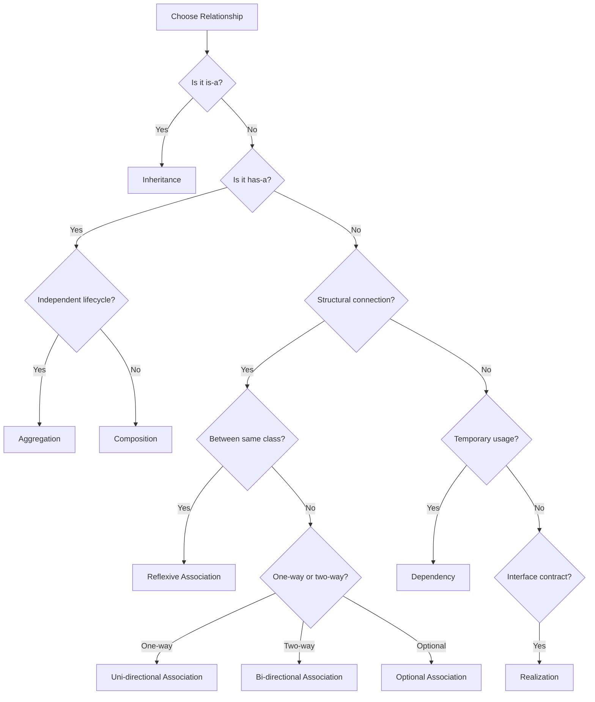

# 🔗 UML Association Relationship

## 📐 1. Symbol
**UML Notation:** `──────`

**Visual Representation:**
```
[ClassA] ────── [ClassB]
```

**With Multiplicity:**
```
[Professor] 1 ────── 1..* [Course]
```

## 🔄 2. Mermaid Symbol
**Mermaid Code:** `ClassA -- ClassB`

**With Roles/Multiplicity:**


## 📖 3. Definition
> 🎯 **Association** is a **"knows-a"** or **"has-a-reference-to"** relationship that represents a structural connection between objects, where one object knows about and can interact with another object.

## 📝 4. Brief Description
🤝 Association represents relationships where objects:

- ✅ Know about each other
- ✅ Can communicate and interact
- ✅ Have independent lifecycles
- ✅ Can be bidirectional or unidirectional
- ✅ Often include multiplicity constraints

## ⭐ 5. Characteristics

| Feature | Description | Emoji |
|---------|-------------|--------|
| **Relationship Type** | "Knows-a", "Has-a-reference" | 🔗 |
| **Strength** | Medium coupling | 🎯 |
| **Lifecycle** | Independent | 🔄 |
| **Directionality** | Bi-directional or Uni-directional | ↔️ / → |
| **Multiplicity** | Supported (1, *, 0..1, etc.) | 🔢 |
| **PHP Implementation** | Object references | 🐘 |

**🎯 Key Points:**
- ✅ Structural relationship
- ✅ Objects can exist independently
- ✅ Supports multiplicity
- ✅ Can be navigable in one or both directions
- ⚠️ Can create coupling if overused

## 📊 6. Mermaid Diagram



## 🚀 7. Use Cases

- ### 🎯 When to Use Association

| Use Case | Example | Reason |
|----------|---------|--------|
| **🤝 Peer Relationships** | `Professor` ↔ `Course` | Objects need to collaborate |
| **📊 Structural Links** | `Customer` → `Order` | Natural business relationships |
| **🔄 Bidirectional Navigation** | `User` ↔ `Profile` | Need to navigate both ways |
| **🎯 Loose Coupling** | `Controller` → `Service` | Better than tight inheritance |

- ### ⚠️ When to Avoid Association

| Scenario | Better Approach | Reason |
|----------|----------------|--------|
| **Ownership with shared lifecycle** | 🎯 **Composition** | Strong "has-a" relationship |
| **Collections with independent objects** | 🎯 **Aggregation** | Weak "has-a" relationship |
| **Temporary usage** | 🎯 **Dependency** | Short-term interaction |
| **Implementation contract** | 🎯 **Realization** | Interface implementation |

## 🔄 8. Association Variants

- ### ➡️ Uni-directional Association
**One-way relationship where only one class knows about the other**

```php
class Order {
    private Customer $customer; // Order knows Customer
    
    public function __construct(Customer $customer) {
        $this->customer = $customer;
    }
}

class Customer {
    private string $name;
    // No reference to Order - Customer doesn't know about Order
}

// Usage
$customer = new Customer("John");
$order = new Order($customer);
// Order can access Customer, but Customer cannot access Order
```

- ### ↔️ Bi-directional Association
**Two-way relationship where both classes know about each other**

```php
class Professor {
    private string $name;
    private array $courses = [];
    
    public function addCourse(Course $course): void {
        $this->courses[] = $course;
        $course->setProfessor($this); // Set the reverse reference
    }
}

class Course {
    private string $title;
    private ?Professor $professor = null;
    
    public function setProfessor(Professor $professor): void {
        $this->professor = $professor;
    }
}

// Usage
$professor = new Professor("Dr. Smith");
$course = new Course("Mathematics");
$professor->addCourse($course);
// Both Professor and Course can access each other
```

- ### 🔄 Reflexive Association
**Relationship where objects of the same class are associated with each other**

```php
class Employee {
    private string $name;
    private ?Employee $manager = null;
    private array $subordinates = [];
    
    public function addSubordinate(Employee $employee): void {
        $this->subordinates[] = $employee;
        $employee->setManager($this);
    }
    
    public function setManager(Employee $manager): void {
        $this->manager = $manager;
    }
}

// Usage - Organizational Hierarchy
$ceo = new Employee("Alice");
$manager = new Employee("Bob");
$developer = new Employee("Charlie");

$ceo->addSubordinate($manager);
$manager->addSubordinate($developer);
// Employees can have managers and subordinates (same class)
```

- ### ❓ Optional Association
**Relationship where the association may or may not exist (0..1 multiplicity)**

```php
class User {
    private string $username;
    private ?Profile $profile = null; // Optional association
    
    public function setProfile(?Profile $profile): void {
        $this->profile = $profile;
    }
    
    public function getProfile(): ?Profile {
        return $this->profile;
    }
}

class Profile {
    private string $bio;
    private User $user; // Mandatory association back to User
}

// Usage
$user1 = new User("john_doe");
$user2 = new User("jane_smith");

$profile = new Profile("Software developer");
$user1->setProfile($profile); // User1 has a profile
// User2 has no profile (optional association is null)
```
## 🆚 9. Association Variants Comparisions

| Association Type | Symbol | Lifecycle | Example |
|-----------------|---------|-----------|---------|
| **Uni-directional** | `─────→` | Independent | `Order → Customer` |
| **Bi-directional** | `──────` | Independent | `Professor ↔ Course` |
| **Reflexive** | `──────` | Independent | `Employee → Employee` |
| **Optional** | `0..1 ───` | Independent | `User 0..1 ─── Profile` |

## 📊 10. Association Variants Diagram


## 🆚 11. Association vs Other Relationships

| Aspect | Association 🤝 | Aggregation ◇ | Composition ◆ |
|--------|---------------|---------------|----------------|
| **Relationship** | "Knows-a" | "Has-a" (weak) | "Has-a" (strong) |
| **Lifecycle** | Independent | Independent | Dependent |
| **Ownership** | No | Shared | Exclusive |
| **Strength** | Medium | Medium | Strong |

## 🗺️ 12. Quick Decision Guide



---

<div align="center">

## 🎯 **Association Rule of Thumb**

**"Use association when you can honestly say:  
'This object KNOWS ABOUT that object and they can exist independently'"**

*Example: "A Professor KNOWS ABOUT Courses they teach" ✅  
Example: "A Customer KNOWS ABOUT their Orders" ✅*

**Associations represent PEER RELATIONSHIPS between independent objects**

</div>