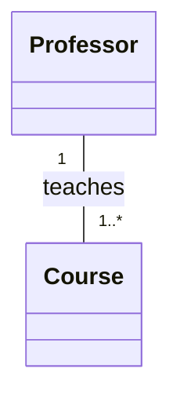
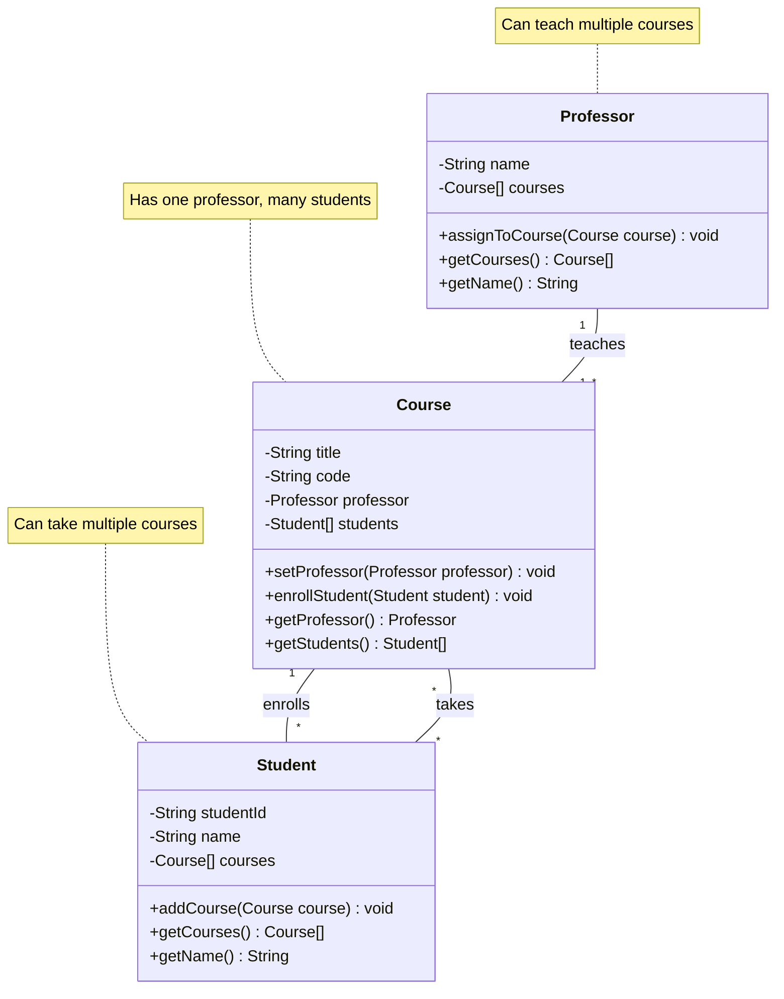
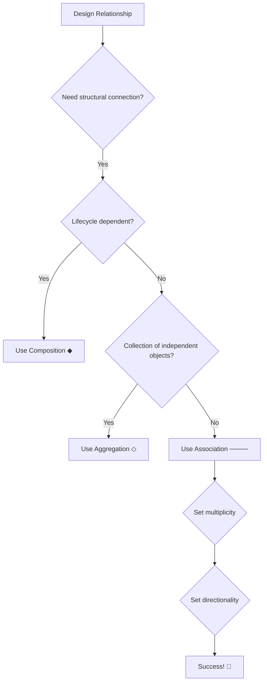

# 🔗 UML Association Relationship

## 📐 1. Symbol
**UML Notation:** `──────`

**Visual Representation:**
```
[ClassA] ────── [ClassB]
```

**With Multiplicity:**
```
[Professor] 1 ────── 1..* [Course]
```

## 🔄 2. Mermaid Symbol
**Mermaid Code:** `ClassA -- ClassB`

**With Roles/Multiplicity:**


## 📖 3. Definition
> 🎯 **Association** is a **"knows-a"** or **"has-a-reference-to"** relationship that represents a structural connection between objects, where one object knows about and can interact with another object.

## 📝 4. Brief Description
🤝 Association represents relationships where objects:

- ✅ Know about each other
- ✅ Can communicate and interact
- ✅ Have independent lifecycles
- ✅ Can be bidirectional or unidirectional
- ✅ Often include multiplicity constraints

## ⭐ 5. Characteristics

| Feature | Description | Emoji |
|---------|-------------|--------|
| **Relationship Type** | "Knows-a", "Has-a-reference" | 🔗 |
| **Strength** | Medium coupling | 🎯 |
| **Lifecycle** | Independent | 🔄 |
| **Directionality** | Bi-directional or Uni-directional | ↔️ / → |
| **Multiplicity** | Supported (1, *, 0..1, etc.) | 🔢 |
| **PHP Implementation** | Object references | 🐘 |

**🎯 Key Points:**
- ✅ Structural relationship
- ✅ Objects can exist independently
- ✅ Supports multiplicity
- ✅ Can be navigable in one or both directions
- ⚠️ Can create coupling if overused

## 📊 6. Mermaid Diagram



## 🚀 7. Use Cases

- ### 🎯 When to Use Association

| Use Case | Example | Reason |
|----------|---------|--------|
| **🤝 Peer Relationships** | `Professor` ↔ `Course` | Objects need to collaborate |
| **📊 Structural Links** | `Customer` → `Order` | Natural business relationships |
| **🔄 Bidirectional Navigation** | `User` ↔ `Profile` | Need to navigate both ways |
| **🎯 Loose Coupling** | `Controller` → `Service` | Better than tight inheritance |

- ### ⚠️ When to Avoid Association

| Scenario | Better Approach | Reason |
|----------|----------------|--------|
| **Ownership with shared lifecycle** | 🎯 **Composition** | Strong "has-a" relationship |
| **Collections with independent objects** | 🎯 **Aggregation** | Weak "has-a" relationship |
| **Temporary usage** | 🎯 **Dependency** | Short-term interaction |
| **Implementation contract** | 🎯 **Realization** | Interface implementation |

## 🔄 8. Association Variants

#### Uni-directional Association
```php
class Order {
    private Customer $customer; // Order knows Customer
    // Customer doesn't know about Order
}

class Customer {
    // No reference to Order
}
```

#### Bi-directional Association
```php
class Order {
    private Customer $customer;
}

class Customer {
    private array $orders = []; // Customer also knows Orders
}
```

## 🆚 9. Association vs Other Relationships

| Aspect | Association 🤝 | Aggregation ◇ | Composition ◆ |
|--------|---------------|---------------|----------------|
| **Relationship** | "Knows-a" | "Has-a" (weak) | "Has-a" (strong) |
| **Lifecycle** | Independent | Independent | Dependent |
| **Ownership** | No | Shared | Exclusive |
| **Strength** | Medium | Medium | Strong |

## 🗺️ 10. Quick Decision Guide



---

<div align="center">

## 🎯 **Association Rule of Thumb**

**"Use association when you can honestly say:  
'This object KNOWS ABOUT that object and they can exist independently'"**

*Example: "A Professor KNOWS ABOUT Courses they teach" ✅  
Example: "A Customer KNOWS ABOUT their Orders" ✅*

**Associations represent PEER RELATIONSHIPS between independent objects**

</div>