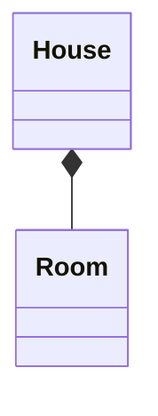
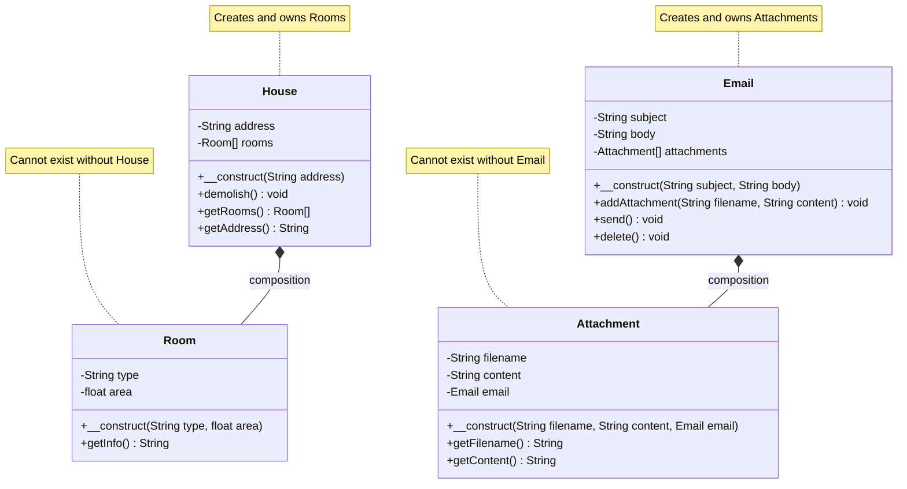
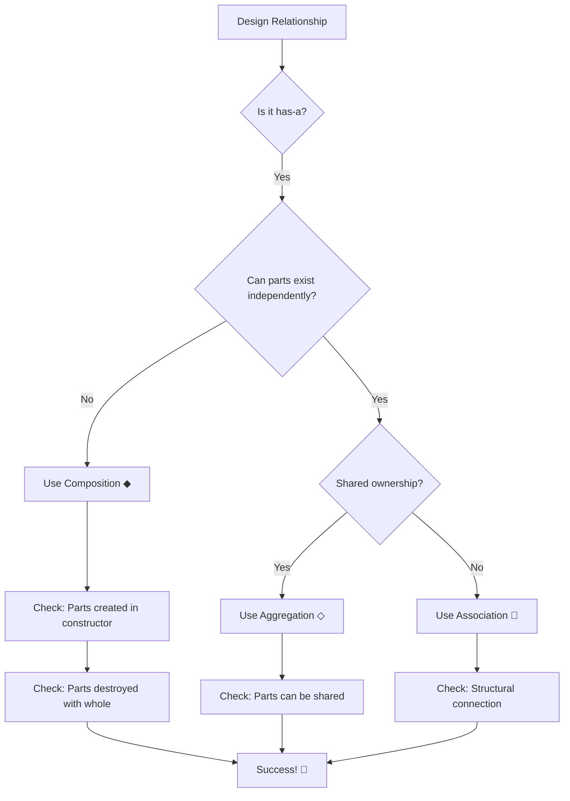

# 🏗️ UML Composition Relationship

## 📐 1. Symbol
**UML Notation:** `◆────`

**Visual Representation:**
```
[Whole] ◆──── [Part]
```

## 🔄 2. Mermaid Symbol
**Mermaid Code:** `Whole *-- Part`

**Example:**


## 📖 3. Definition
> 🎯 **Composition** is a strong **"has-a"** relationship where the part cannot exist independently of the whole. The whole owns the part exclusively and controls its lifecycle.

## 📝 4. Brief Description
🏠 Composition represents the strongest form of ownership in UML:

- ✅ **Strong "has-a"** relationship
- ✅ **Exclusive ownership** - parts belong to only one whole
- ✅ **Shared lifecycle** - parts are created/destroyed with the whole
- ✅ **No independent existence** - parts cannot exist without the whole

## ⭐ 5. Characteristics

| Feature | Description | Emoji |
|---------|-------------|--------|
| **Relationship Type** | Strong "has-a" | 🏠 |
| **Strength** | Very strong coupling | 💪 |
| **Lifecycle** | Dependent | 🔗 |
| **Ownership** | Exclusive | 🔒 |
| **Multiplicity** | Usually 1-to-many | 🔢 |
| **Persistence** | Stored references | ✅ |
| **PHP Implementation** | Object creation in constructor/method | 🐘 |

**🎯 Key Points:**
- ✅ Parts are created when the whole is created
- ✅ Parts are destroyed when the whole is destroyed
- ✅ Parts cannot be shared between wholes
- ✅ Strong encapsulation
- ⚠️ Creates tight coupling

## 📊 6. Mermaid Diagram



## 🚀 7. Use Cases

- ### 🎯 When to Use Composition

| Use Case | Example | Reason |
|----------|---------|--------|
| **Strong Ownership** | `House` → `Room` | Rooms cannot exist without house |
| **Component Creation** | `Car` → `Engine` | Engine created with car |
| **Document Structure** | `Book` → `Chapter` | Chapters belong to specific book |
| **Temporary Objects** | `Game` → `Level` | Levels exist only during game |

- ### ⚠️ When to Avoid Composition

| Scenario | Better Approach | Reason |
|----------|----------------|--------|
| **Independent objects** | **Aggregation** | Parts can exist independently |
| **Shared objects** | **Association** | Objects can be shared |
| **Temporary usage** | **Dependency** | Short-term interaction |

- ## 🆚 8. Composition vs Aggregation

| Aspect | Composition ◆ | Aggregation ◇ |
|--------|---------------|---------------|
| **Relationship** | "Parts-of" | "Belongs-to" |
| **Lifecycle** | Dependent | Independent |
| **Ownership** | Exclusive | Shared |
| **Strength** | Strong | Weak |
| **Example** | `House` → `Room` | `University` → `Professor` |

## 🎯 9. Quick Decision Guide



---

<div align="center">

## 🎯 **Composition Rule of Thumb**

**"Use composition when you can honestly say:  
'If the whole is destroyed, the parts should be destroyed too'"**

*Example: "If a House is demolished, its Rooms should be destroyed" ✅  
Counter-example: "If a University closes, its Professors continue to exist" ❌*

**Composition represents INSEPARABLE PART-WHOLE relationships**

</div>