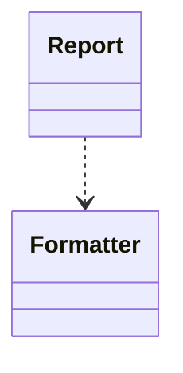
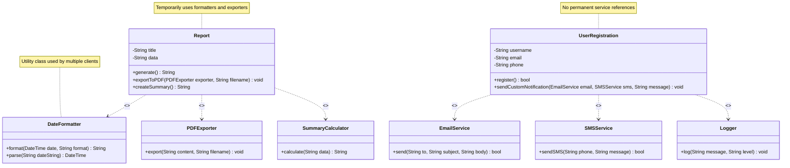
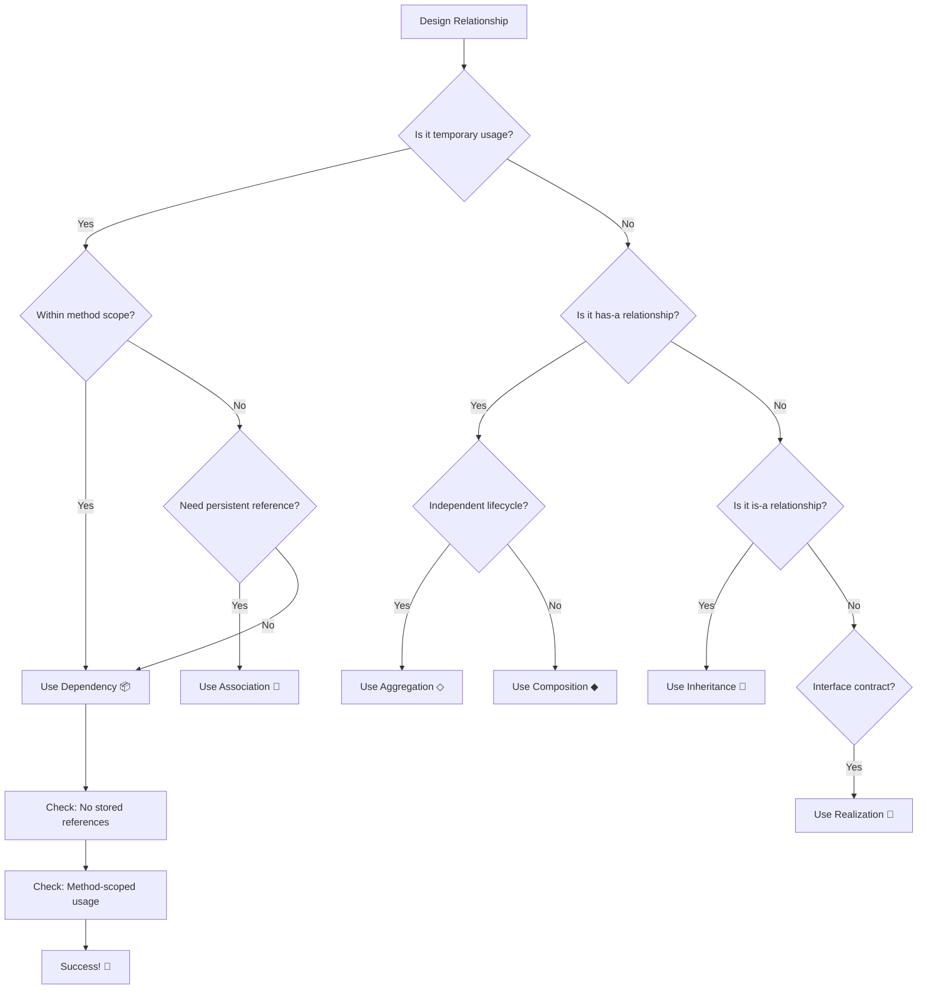

# 📦 UML Dependency Relationship

## 📐 1. Symbol
**UML Notation:** `- - - ->`

**Visual Representation:**
```
[Client] - - - -> [Supplier]
```

## 🔄 2. Mermaid Symbol
**Mermaid Code:** `Client ..> Supplier`

**Example:**


## 📖 3. Definition
> 🎯 **Dependency** is a **"uses-a"** relationship where one class temporarily uses another class, but there's no long-term structural relationship between them.

## 📝 4. Brief Description
⚡ Dependency represents the weakest and most temporary relationship in UML:

- ✅ **Temporary "uses-a"** relationship
- ✅ **No structural connection** - no object references stored
- ✅ **Short-term usage** - typically within method scope
- ✅ **Loose coupling** - minimal impact on design

## ⭐ 5. Characteristics

| Feature | Description | Emoji |
|---------|-------------|--------|
| **Relationship Type** | Temporary "uses-a" | ⚡ |
| **Strength** | Weakest coupling | 🪶 |
| **Lifecycle** | None (method scope) | ⏱️ |
| **Persistence** | No stored references | 🚫 |
| **PHP Implementation** | Method parameters, local variables, static calls | 🐘 |

**🎯 Key Points:**
- ✅ Supplier is used within Client's methods
- ✅ No long-term association between objects
- ✅ Changes in Supplier may affect Client
- ✅ Promotes loose coupling
- ⚠️ Overuse can indicate design issues

## 🐘 6. PHP Example


### Advanced Dependency Example
```php
<?php
// 🎯 Advanced Example: Notification System with Dependencies
class EmailService {
    public function send(string $to, string $subject, string $body): bool {
        echo "📧 Email sent to: {$to}\n";
        echo "Subject: {$subject}\n";
        echo "Body: {$body}\n";
        return true;
    }
}

class SMSService {
    public function sendSMS(string $phone, string $message): bool {
        echo "📱 SMS sent to: {$phone}\n";
        echo "Message: {$message}\n";
        return true;
    }
}

class Logger {
    public static function log(string $message, string $level = 'INFO'): void {
        $timestamp = date('Y-m-d H:i:s');
        echo "[{$timestamp}] {$level}: {$message}\n";
    }
}

class UserRegistration {
    private string $username;
    private string $email;
    private string $phone;
    
    public function __construct(string $username, string $email, string $phone) {
        $this->username = $username;
        $this->email = $email;
        $this->phone = $phone;
    }
    
    // 🎯 MULTIPLE DEPENDENCIES in one method
    public function register(): bool {
        // 📦 Dependency: Logger (static call)
        Logger::log("Starting registration for user: {$this->username}");
        
        // Simulate user creation in database
        echo "👤 User '{$this->username}' created in database\n";
        
        // 📦 Dependency: EmailService (local variable)
        $emailService = new EmailService();
        $emailSent = $emailService->send(
            $this->email,
            "Welcome to Our Service",
            "Hello {$this->username}, welcome to our platform!"
        );
        
        // 📦 Dependency: SMSService (local variable)
        $smsService = new SMSService();
        $smsSent = $smsService->sendSMS(
            $this->phone,
            "Welcome {$this->username}! Your account is ready."
        );
        
        // 📦 Dependency: Logger (static call)
        if ($emailSent && $smsSent) {
            Logger::log("Registration completed successfully for: {$this->username}");
        } else {
            Logger::log("Registration had notification issues for: {$this->username}", "WARN");
        }
        
        return true;
    }
    
    // 🎯 DEPENDENCY: Method with parameter dependencies
    public function sendCustomNotification(
        EmailService $emailService, 
        SMSService $smsService, 
        string $message
    ): void {
        // Temporary usage of dependencies passed as parameters
        $emailService->send($this->email, "Notification", $message);
        $smsService->sendSMS($this->phone, $message);
        
        Logger::log("Custom notification sent to: {$this->username}");
    }
}

// 🚀 Usage Example
echo "=== User Registration Dependency Demo ===\n\n";

$user = new UserRegistration("john_doe", "john@example.com", "+1234567890");

echo "--- Registering User ---\n";
$user->register();

echo "\n--- Sending Custom Notification ---\n";
$user->sendCustomNotification(
    new EmailService(),
    new SMSService(),
    "Your premium subscription has been activated!"
);

echo "\n=== End of Demo ===\n";

// 🎯 Key Observations:
// - UserRegistration has NO permanent references to EmailService, SMSService, Logger
// - All dependencies are temporary and method-scoped
// - This promotes loose coupling and testability
?>
```

## 📊 7. Mermaid Diagram



## 🚀 8. Use Cases

- ### 🎯 When to Use Dependency

| Use Case | Example | Reason |
|----------|---------|--------|
| **Utility Functions** | `StringUtils::sanitize()` | Temporary helper usage |
| **Method Parameters** | `processPayment(Logger $logger)` | External services passed in |
| **Local Calculations** | `new Calculator()` | Short-lived objects |
| **Static Helpers** | `DateFormatter::format()` | No object state needed |
| **Factory Methods** | `DocumentFactory::create()` | Object creation only |

- ### ⚠️ When to Avoid Dependency

| Scenario | Better Approach | Reason |
|----------|----------------|--------|
| **Long-term relationships** | 🎯 **Association** | Persistent object references |
| **Object ownership** | 🎯 **Composition** | Whole-part relationships |
| **Interface contracts** | 🎯 **Realization** | Formal implementation |
| **Shared collections** | 🎯 **Aggregation** | Group relationships |

## 🆚 Dependency vs Association

| Aspect | Dependency 📦 | Association 🤝 |
|--------|---------------|----------------|
| **Duration** | Temporary | Persistent |
| **Storage** | No references stored | References stored |
| **Strength** | Weak | Medium |
| **Usage** | Method-level | Object-level |
| **Example** | `Report ..> Formatter` | `Professor -- Course` |

## 🎯 Quick Decision Guide



---

<div align="center">

## 🎯 **Dependency Rule of Thumb**

**"Use dependency when you can honestly say:  
'I only need this temporarily within a method'"**

*Example: "A Report temporarily uses a Formatter to format dates" ✅  
Counter-example: "A Professor persistently teaches Courses" ❌*

**Dependency represents TEMPORARY USAGE, not structural relationships**

</div>