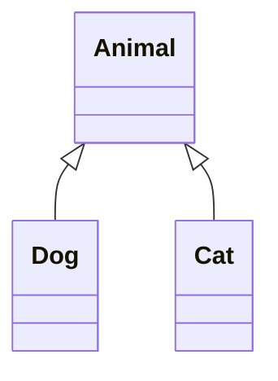
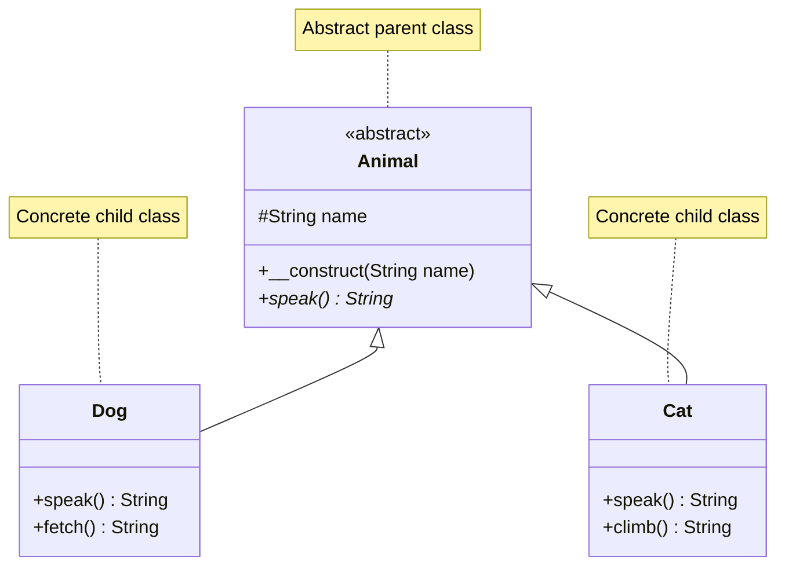
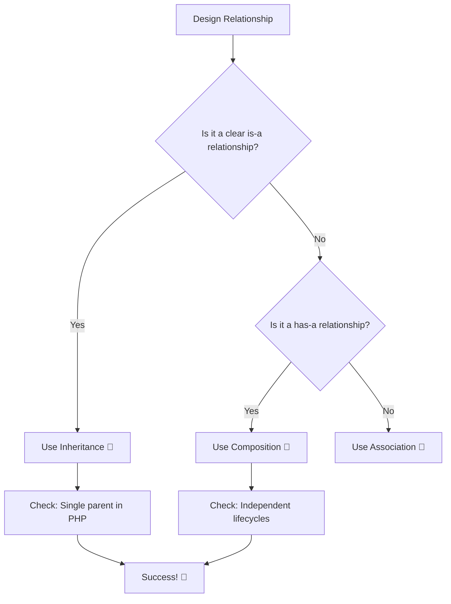

# 🎯 UML Inheritance Relationship

## 📐 1. Symbol
**UML Notation:** `─────▷`

**Visual Representation:**
```
[Parent Class] ─────▷ [Child Class]
```

## 🔄 2. Mermaid Symbol
**Mermaid Code:** `Parent <|-- Child`

**Example:**


## 📖 3. Definition
> 🎯 **Inheritance** (also called Generalization) is an **"is-a"** relationship where a child class (subclass) inherits properties and methods from a parent class (superclass), enabling code reuse and hierarchical classification.

## 📝 4. Brief Description
🏗️ Inheritance allows creating new classes based on existing ones, where the child class:

- ✅ Inherits all public and protected members from parent
- ✅ Can add new properties and methods  
- ✅ Can override parent methods
- ✅ Represents a hierarchical **"is-a"** relationship

## ⭐ 5. Characteristics

| Feature | Description | Emoji |
|---------|-------------|--------|
| **Relationship Type** | "Is-a" | 🔗 |
| **Strength** | Strong coupling | 💪 |
| **Reusability** | High | ♻️ |
| **PHP Syntax** | `extends` keyword | 🐘 |
| **Multiple Inheritance** | Not supported in PHP | ❌ |
| **Access Control** | Respects access modifiers | 🔒 |

**🎯 Key Points:**
- ✅ Promotes code reuse
- ✅ Supports polymorphism  
- ✅ Creates logical hierarchies
- ⚠️ Can lead to tight coupling
- ⚠️ Deep hierarchies become complex

## 📊 6. Mermaid Diagram



## 🚀 7. Use Cases

- ### 🎯 When to Use Inheritance

| Use Case | Example | Reason |
|----------|---------|--------|
| **🔄 Code Reuse** | `Vehicle` → `Car`, `Motorcycle` | Shared functionality |
| **🏛️ Hierarchical Modeling** | `Employee` → `Manager`, `Developer` | Natural "is-a" relationships |
| **🎭 Polymorphism** | `Shape` → `Circle`, `Rectangle` | Treat different types uniformly |
| **📐 Framework Extensions** | `BaseController` → `UserController` | Extend framework functionality |

- ### ⚠️ When to Avoid Inheritance

| Scenario | Better Approach | Reason |
|----------|----------------|--------|
| **"Has-a" relationship** | **Composition** | `Car` has `Engine`, not is `Engine` |
| **Multiple parents needed** | **Interfaces + Composition** | PHP doesn't support multiple inheritance |
| **Fragile base class** | **Dependency Injection** | Parent changes break children |
| **Unclear "is-a" relationship** | **Re-evaluate design** | Forced inheritance creates confusion |

## 🗺️ 8. Quick Decision Guide



---

<div align="center">

## 🎯 **Inheritance Rule of Thumb**

**"Use inheritance only when you can honestly say:  
'The child class IS A TYPE OF the parent class'"**

*Example: "A Dog IS A TYPE OF Animal" ✅  
Counter-example: "A Car IS A TYPE OF Engine" ❌*

</div>