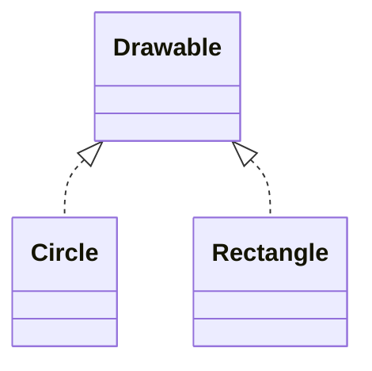
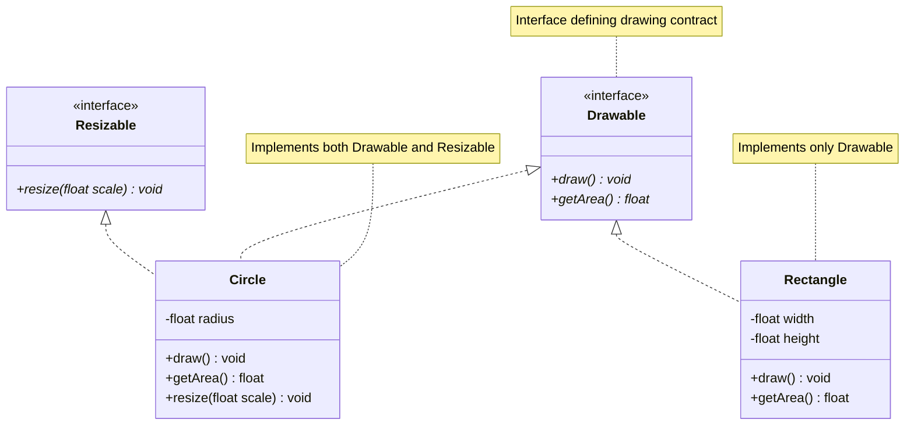
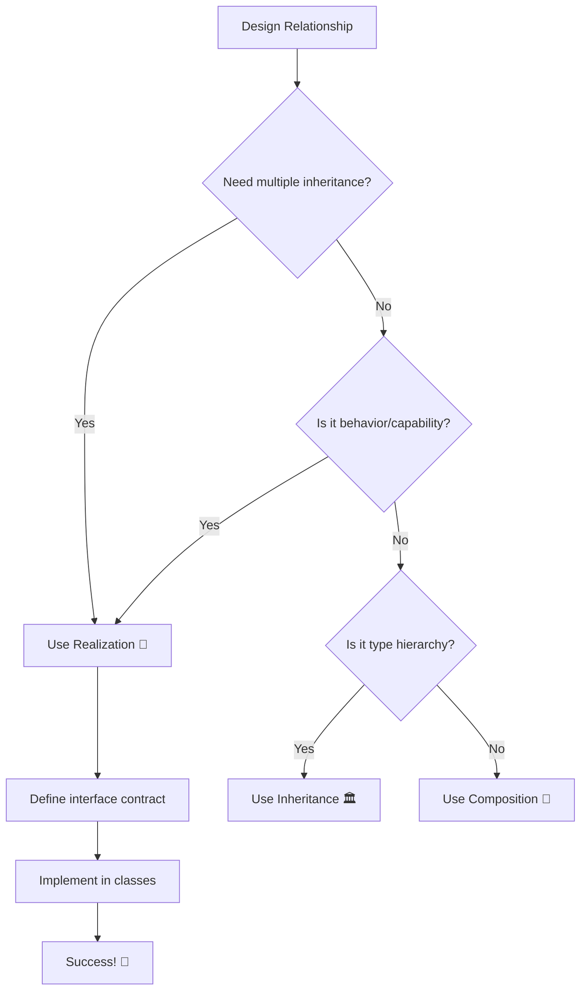

# 🎯 UML Realization Relationship

## 📐 1. Symbol
**UML Notation:** `- - - - - ▷`

**Visual Representation:**
```
[Class] - - - - - ▷ [Interface]
```

## 🔄 2. Mermaid Symbol
**Mermaid Code:** `Class <|.. Interface`

**Example:**


## 📖 3. Definition
> 🎯 **Realization** is a **"implements"** relationship where a class agrees to fulfill the contract specified by an interface, providing concrete implementations for all interface operations.

## 📝 4. Brief Description
📜 Realization allows classes to implement interfaces, where the class:

- ✅ Must implement all interface methods
- ✅ Can implement multiple interfaces
- ✅ Follows a strict "contract"
- ✅ Enables polymorphism without inheritance

## ⭐ 5. Characteristics

| Feature | Description | Emoji |
|---------|-------------|--------|
| **Relationship Type** | "Implements" | 📝 |
| **Strength** | Medium coupling | 🎯 |
| **Flexibility** | High (multiple interfaces) | 🔄 |
| **PHP Syntax** | `implements` keyword | 🐘 |
| **Multiple Realization** | Supported in PHP | ✅ |
| **Contract Enforcement** | Strict - all methods must be implemented | 📋 |

**🎯 Key Points:**
- ✅ Enables polymorphism
- ✅ Supports multiple interfaces
- ✅ Loose coupling
- ✅ Contract-based design
- ⚠️ Must implement all methods

## 📊 6. Mermaid Diagram



## 🚀 7. Use Cases

- ### 🎯 When to Use Realization

| Use Case | Example | Reason |
|----------|---------|--------|
| **📝 Multiple Behaviors** | `Flyable`, `Swimmable` interfaces | Classes can have multiple capabilities |
| **🔧 Plugin Architecture** | `PaymentGateway` interface | Easy to add new implementations |
| **🎭 Polymorphic Behavior** | `Notifiable` interface | Treat different notifiers uniformly |
| **🧪 Testing/Mocking** | `DataStorage` interface | Easy to create test doubles |

- ### ⚠️ When to Avoid Realization

| Scenario | Better Approach | Reason |
|----------|----------------|--------|
| **Shared implementation code** | **Abstract Class + Interface** | Interfaces can't provide implementation |
| **"Is-a" relationship** | **Inheritance** | Use interfaces for "behaves-like" not "is-a" |
| **Tight coupling needed** | **Concrete Classes** | Sometimes simple is better |

## 🆚 8. Realization vs Inheritance

| Aspect | Realization 📜 | Inheritance 🏛️ |
|--------|----------------|-----------------|
| **Relationship** | "Implements" | "Is-a" |
| **Multiple** | ✅ Yes | ❌ No (in PHP) |
| **Code Reuse** | ❌ No implementation | ✅ Yes |
| **Coupling** | 🟡 Loose | 🔴 Tight |
| **Flexibility** | 🟢 High | 🟡 Medium |

## 🗺️ 9. Quick Decision Guide



---

<div align="center">

## 🎯 **Realization Rule of Thumb**

**"Use realization when you can honestly say:  
'This class CAN BEHAVE LIKE the interface specifies'"**

*Example: "A Circle CAN BEHAVE LIKE a Drawable" ✅  
Example: "A PaymentProcessor CAN BEHAVE LIKE a Refundable" ✅*

**Interfaces define CAPABILITIES, not identities**

</div>